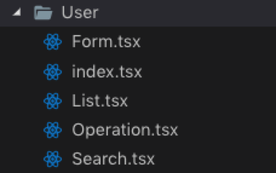
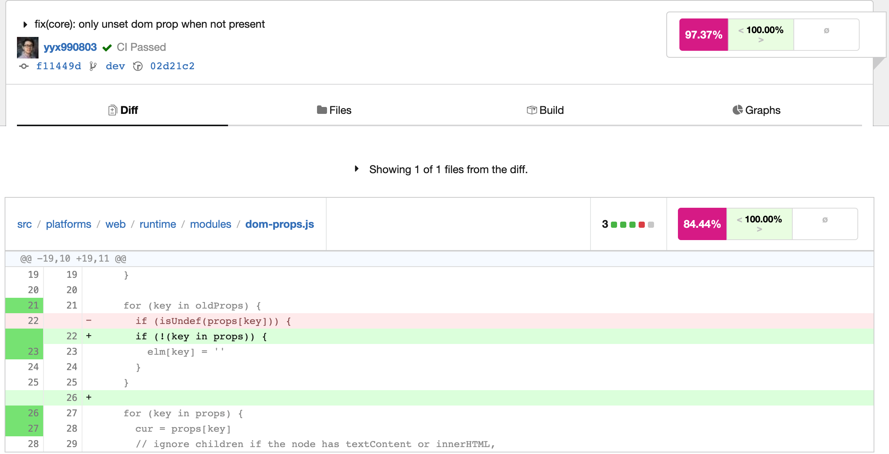
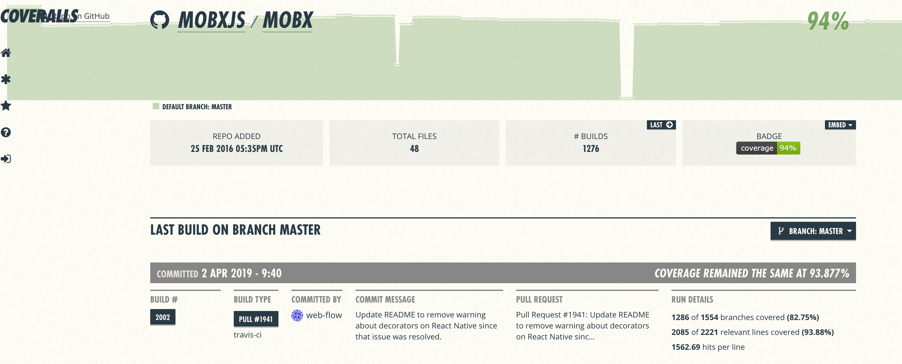

# 前端 React 单元测试

## 前言

长期以来，前端开发的单元测试并不是在前端的开发过程中所必须的，也不是每个前端开发工程师所注意和重视的，
甚至扩大到软件开发过程中单元测试这一环也不是在章程上有书面规定所要求的。曾经的我也问过许多次自己以及身边的前端工程师。
为什么前端要写单元测试？前端的单元测试和测试工程师的测试有什么区别？在开发过程中，花费大量时间（甚至可能大于 50%）的之间去写单元测试值不值得？

### 为什么要进行测试？？

1. 测试可以确保得到预期的结果
2. 作为现有代码行为的描述
3. 促使开发者写可测试的代码，一般可测试的代码可读性也会高一点
4. 如果依赖的组件有修改，受影响的组件能在测试中发现错误

### 测试类型

-   单元测试：指的是以原件的单元为单位，对软件进行测试。单元可以是一个函数，也可以是一个模块或一个组件，基本特征就是只要输入不变，必定返回同样的输出。一个软件越容易写单元测试，就表明它的模块化结构越好，给模块之间的耦合越弱。React 的组件化和函数式编程，天生适合进行单元测试
-   功能测试：相当于是黑盒测试，测试者不了解程序的内部情况，不需要具备编程语言的专门知识，只知道程序的输入、输出和功能，从用户的角度针对软件界面、功能和外部结构进行测试，不考虑内部的逻辑
-   集成测试：在单元测试的基础上，将所有模块按照设计要求组装成子系统或者系统，进行测试
-   冒烟测试：在正式全面的测试之前，对主要功能进行的测试，确认主要功能是否满足需要，软件是否能正常运行

### 开发模式

-   TDD: 测试驱动开发，英文为 Testing Driven Development，强调的是一种开发方式，以测试来驱动整个项目，即先根据接口完成测试编写，然后在完成功能是要不断通过测试，最终目的是通过所有测试
-   BDD: 行为驱动测试，英文为 Behavior Driven Development，强调的是写测试的风格，即测试要写的像自然语言，让项目的各个成员甚至产品都能看懂测试，甚至编写测试

TDD 和 BDD 有各自的使用场景，BDD 一般偏向于系统功能和业务逻辑的自动化测试设计；而 TDD 在快速开发并测试功能模块的过程中则更加高效，以快速完成开发为目的。

## 准备: 前端环境

常见环境部署方法，基本都是在 nodejs 官网下载 exe，msi 文件双击安装后直接可用。
nodejs 是一门更新很快的语言，我们常常要维护老项目，老项目依赖某个较早的 nodejs 版本，随便升级会生成莫名其妙的错误。
而 nodejs 的生态环境是总在不断向前推进的，很多工具，第三方包都在前进，舍弃旧环境。
很多时候如果环境不升级，我们需要手动安装很多老版本工具，而且连文档都查阅都会混乱，我们程序员也有需要保持最新的知识栈的需求。
此处推荐使用编程语言版本切换工具 🍀，nodejs 的就是[nvm](https://github.com/creationix/nvm)，
全称 Node Version Manager，官网有多系统安装方式。

## 单元测试工具

说起单元测试，市面上的单元测试工具形形色色，五花八门。最常使用的工具为:Jest Mocha Jasmine

-   🛠 工具[Jest](https://www.npmjs.com/package/eslint)
    安装

    ```bash
    yarn add jest -global
    ```

    -   facebook 坐庄
    -   基于 Jasmine 至今已经做了大量修改添加了很多特性
    -   开箱即用配置少，API 简单
    -   支持断言和仿真
    -   支持快照测试
    -   在隔离环境下测试
    -   互动模式选择要测试的模块
    -   优雅的测试覆盖率报告，基于 Istanbul
    -   智能并行测试(参考)
    -   较新，社区不十分成熟
    -   全局环境，比如 describe 不需要引入直接用
    -   较多用于 React 项目(但广泛支持各种项目)

-   🛠 工具[Mocha](https://mochajs.org/)
    安装

    ```bash
    yarn add mocha
    ```

    -   灵活(不包括断言和仿真，自己选对应工具)
    -   流行的选择：chai，sinon
    -   社区成熟用的人多，测试各种东西社区都有示例
    -   需要较多配置
    -   可以使用快照测试，但依然需要额外配置

个人推荐使用 jest 进行单元测试。理由如下：

-   jest 与 babel 对 es6 的转码集成良好。
-   jest 的 api 文档完整且 api 设计良好。
-   jest 对异步代码测试内置支持完善。
-   jest 内置完善的 mock 与 stub 工具。
-   jest 运行如飞。
-   jest 可自调用 istanbul，无痛生成覆盖率统计文档。
-   jest 使用约定大于配置的原则，需配置项较少，且同时兼顾定制需求。
-   使用 jsdom，在 nodejs 环境可模拟浏览器环境，与 jest 集成后测试前端的浏览器环境代码。
-   jest 文档丰富且有广泛的开发者基础。

(Jest 常用 API)[https://jestjs.io/docs/en/api.html]

-   describe(name, fn)：描述块，讲一组功能相关的测试用例组合在一起
-   it(name, fn, timeout)：别名 test，用来放测试用例
-   afterAll(fn, timeout)：所有测试用例跑完以后执行的方法
-   beforeAll(fn, timeout)：所有测试用例执行之前执行的方法
-   afterEach(fn)：在每个测试用例执行完后执行的方法
-   beforeEach(fn)：在每个测试用例执行之前需要执行的方法

Enzyme

Enzyme 是 Airbnb 开源的 React 测试工具库库，它功能过对官方的测试工具库 ReactTestUtils 的二次封装，提供了一套简洁强大的 API。
实现了 jQuery 风格的方式进行 DOM 处理，开发体验十分友好。在开源社区有超高人气，同时也获得了 React 官方的推荐。

三种渲染方法

-   shallow：浅渲染，是对官方的 Shallow Renderer 的封装。将组件渲染成虚拟 DOM 对象，只会渲染第一层，子组件将不会被渲染出来，使得效率非常高。不需要 DOM 环境， 并可以使用 jQuery 的方式访问组件的信息
-   render：静态渲染，它将 React 组件渲染成静态的 HTML 字符串，然后使用 Cheerio 这个库解析这段字符串，并返回一个 Cheerio 的实例对象，可以用来分析组件的 html 结构
-   mount：完全渲染，它将组件渲染加载成一个真实的 DOM 节点，用来测试 DOM API 的交互和组件的生命周期。用到了 jsdom 来模拟浏览器环境

测试的渐进性：

1. 函数单元测试
2. 组件单元测试
3. 页面单元测试
4. E2E 测试

最终为了各种场景下 React 的单元测试，集成了下面的 lib：

-   Jest：单元测试框架
-   enzyme： React 测试库
-   enzyme-adapter-react-16： enzyme 和 React 的配套库 用于保证 enzyme 渲染的版本和你使用的 React 版本是一致的。
-   fetch-mock： 异步请求模拟
-   babel-7-jest:Jest 对应的 babel
-   eslint-plugin-jest：jest 对应的 eslint
-   jsdom：虚拟 dom 环境

## 函数式单元测试

### 测试前须知

1. 使用 Jest 进行单元测试必须保证函数式纯函数。即函数有入参并以 return 结尾。
2. 函数尽量不要依赖外部变量。
3. react 函数（返回值为 JSX）不属于该测试范围
4. jest 配置：在根目录下创建 jest.config.js。

### 测试步骤

1. 写一个纯函数

```javascript
  import moment from 'moment'
  type TDate = string | moment.Moment
  const convert = (date: TDate): moment.Moment => {
    if (typeof date === 'string') {
      return moment(date)
    }
    return date
  }
  export default {
    uponDay: (date: TDate) => date && convert(date).format('YYYY-MM-DD'),
    uponSeconds: (date: TDate) =>
      date && convert(date).format('YYYY-MM-DD HH:mm:ss'),

```

2. 在**test**文件夹下建一个文件 fn.test.js

3. 进行单元测试

```javascript
import dateFormater from 'tool/dateFormater'
import moment from 'moment'

const { uponDay, uponSeconds } = dateFormater

describe('测试dateFormater', () => {
    it('测试格式化到天，无时分秒', () => {
        expect(uponDay(moment('2018-09-20'))).toBe('2018-09-20')
    })
    it('测试格式化到天，无时分秒，日期为字符串类型', () => {
        expect(uponDay('2018-09-20')).toBe('2018-09-20')
    })
    it('测试格式化到天，带时分秒', () => {
        expect(uponDay(moment('2018-09-20 08:08:00'))).toBe('2018-09-20')
    })
    it('测试格式化到秒', () => {
        expect(uponSeconds(moment('2018-09-26T16:45:36.000+0000'))).toBe(
            '2018-09-27 00:45:36',
        )
    })
    it('测试格式化到秒，日期为字符串类型', () => {
        expect(uponSeconds('2018-09-26T16:45:36.000+0000')).toBe(
            '2018-09-27 00:45:36',
        )
    })
})
```

## 组件单元测试

### 测试前须知

1. 使用 Jest 进行组件测试需要模拟浏览器环境，目前与 react 配合较好的是 enzyme 及 jsdom。
2. 一个测试用例只做一件事，所以尽可能将组件拆分为最小单元。
3. 模拟数据及接口使用 fetch-mock
4. 在测试之前执行 steup 函数将所有环境模拟好，在测试中直接使用即可

### 测试组件内容

React 组件分为四种：

1. 展示型业务组件
2. 容器型业务组件
3. 通用 UI 组件
4. 业务、功能型组件

测试的重点主要放在业务、功能型组件

业务、功能型组件必须测试的三部分：

1. Props 传入；
2. 组件分支渲染逻辑；
3. 事件调用和参数传递。

### 测试步骤

就拿一个简单的权限高阶组件做例子：

```javascript
import React from 'react'
import { Provider } from 'mobx-react'
import { mount } from 'enzyme'
import Permission from 'component/Permission'
import permissionStore from 'store/permission'

const TestPermission = () => (
    <Provider store={{ permissionStore }}>
        <Permission resource="ok">
            <span>hasPermission</span>
        </Permission>
    </Provider>
)

describe('component/Permission', () => {
    it('测试无权限', () => {
        const app = mount(<TestPermission />)
        expect(permissionStore.has('ok')).toBe(false)
        expect(app.text()).toBe(null)
    })

    it('测试有权限', () => {
        permissionStore.data.add('ok')
        const app = mount(<TestPermission />)
        expect(permissionStore.has('ok')).toBe(true)
        expect(app.text()).toBe('hasPermission')
    })
})
```

## 页面级别单元测试

通常页面级别的单元测试是不需要前端来做的。页面通常被分割成多个公用的组件及 Store（MVVM 下），数据与表现分离，即数据层和通用组件层我们已经通过上述 2 种方式进行过相应的单元测试了。页面级别的测试通常只针对简单的文案及 CSS 进行测试就够了。

例如我们可以对一个页面的跟组件进行测试：

```javascript
import React from 'react'
import { shallow } from 'enzyme'
import { Card } from 'antd'
import A from 'page/A'
import Operation from 'page/A/Operation'
import List from 'page/A/List'
import Search from 'page/A/Search'
import CardTitle from 'component/CardTitle'

describe('page/A', () => {
    it('测试页面可完整渲染', () => {
        const app = shallow(<A />)
        expect(app.find(Card)).toHaveLength(1)
        expect(app.contains(<Operation />)).toBeTruthy()
        expect(app.contains(<List />)).toBeTruthy()

        // 测试可完整渲染Card title属性
        const title = app.find(Card).prop('title')
        expect(title.type).toEqual(CardTitle)
        expect(title.props.children.type).toEqual(Search)

        const app2 = shallow(<A showOperation={false} />)
        expect(app2.contains(<Operation />)).toBeFalsy()
    })
})
```

如何让一个页面可测试（方便测试）？？？

如下图所示，讲页面组件拆分成最小单元，保证每个小的组件都是可插拔的。



## E2E 单元测试

问题？？如何确定用户可以顺利走完一个购买流程呢?

1. 打开网页
2. 浏览商品
3. 加入购物车
4. 下单确认
5. 付款

单纯依靠人力来测试完整功能非常耗时耗力, 这时候自动化测试就体现价值了

自动化测试是把人的测试行为转化为机器执行的程序, 可以提高效率, 解放生产力, 节省人力成本和时间成本, 降低人类易出错的风险

现代比较流行的 e2e 测试框架有

-   Nightwatch
-   TestCafe
-   Protractor
-   WebdriverIO
-   Cypress
-   Jest puppeteer

### 测试前须知

1. 通常 E2E 测试是我们正常开发已经完成，最好有完整的测试环境（开发、生产）。
2. E2E 测试需要我们队整个业务逻辑非常熟练，即多页面之间的交互甚至整个项目流程。

下面介绍我主要使用的 2 种 E2E 测试工具 Nightwatch 及 Jest puppeteer

Nightwatch

```javascript
module.exports = {
    'test notFound page': browser => {
        browser
            .url('http://localhost:8080/xxxx')
            .maximizeWindow()
            .useXpath()
            .assert.containsText('//*[@id="app"]/div[3]/div[2]/h1', '404')
            .assert.containsText(
                '//*[@id="app"]/div[3]/div[2]/h2',
                '抱歉，您访问的页面不存在',
            )
            .pause(1000)
            .assert.urlContains('http://localhost:8080/xxxx')
            .click('//*[@id="app"]/div[3]/div[2]/div/button')
            .pause(1000)
            .assert.urlContains('http://localhost:8080/Home')
            .end()
    },
}
```

Jest puppeteer

```javascript
describe('goto page', () => {
    beforeAll(async () => {
        // page = await browser.newPage()
        await page.setViewport({
            width: 1920,
            height: 1080,
        })
    })

    it('go to user page', async () => {
        await page.goto(`${pageUrl}/user`)
        await page.waitForSelector('label[for="account"]')
        await page.waitForSelector('label[for="name"]')
        await page.waitForSelector('label[for="mail"]')
        await page.waitForSelector('label[for="mobile"]')
    })

    it('coverage', async () => {
        await Promise.all([
            page.coverage.startJSCoverage(),
            page.coverage.startCSSCoverage(),
        ])
        await page.goto(pageUrl)
        await page.hover('.ant-menu-root')
        await page.click('.ant-menu-item a[href="/user"]')
        // await jestPuppeteer.debug()
        const [jsCoverage, cssCoverage] = await Promise.all([
            page.coverage.stopJSCoverage(),
            page.coverage.stopCSSCoverage(),
        ])
        const coverage = [...jsCoverage, ...cssCoverage]
        let totalBytes = 0
        let usedBytes = 0
        coverage.forEach(entry => {
            totalBytes += entry.text.length
            entry.ranges.forEach(range => {
                usedBytes += range.end - range.start - 1
            })
        })
        log(`Bytes used: ${(usedBytes / totalBytes) * 100}%`)
    })
})
```

## 单元测试常用配置

```javascript
{
  //覆盖率统计文件夹及文件
  "collectCoverageFrom": [
    "src/component/**/*.{js,jsx,mjs}",
    "src/page/**/*.{js,jsx,mjs}",
    "src/store/**/*.{js,jsx,mjs}",
    "src/storeProp/**/*.{js,jsx,mjs}",
    "src/mixin/**/*.{js,jsx,mjs}",
    "src/tool/**/*.{js,jsx,mjs}"
  ],
  //入口文件
  "setupFiles": [
    "<rootDir>/jest/setup.js"
  ],
  //测试代码文件
  "testMatch": [
    "<rootDir>/__test__/**/?(*.)(spec|test).{js,jsx,ts,tsx}"
  ],
  //测试Setup之后执行的文件
  "setupTestFrameworkScriptFile": "<rootDir>/jest/afterSetup.js",
  //生成dom所需的库
  "testEnvironment": "enzyme",
  //测试Url
  "testURL": "http://localhost",
  //转换 ES6->5 ts 及 css 文件
  "transform": {
    "^.+\\.(js|jsx|mjs)$": "<rootDir>/node_modules/babel-7-jest",
    "^.+\\.tsx?$": "ts-jest",
    "^.+\\.(css|less)$": "<rootDir>/jest/cssTransform.js"
  },
  //不转换的文件
  "transformIgnorePatterns": [
    "<rootDir>/node_modules/(?!lodash-es/).+(js|jsx|mjs)$"
  ],
  //别名，类似于alias
  "moduleNameMapper": {
    "^component/(.+)$": "<rootDir>/src/component/$1",
    "^tool/(.+)$": "<rootDir>/src/tool/$1",
    "^store/(.+)$": "<rootDir>/src/store/$1",
    "^page/(.+)$": "<rootDir>/src/page/$1",
    "^mixin/(.+)$": "<rootDir>/src/mixin/$1",
    "^storeProp/(.+)$": "<rootDir>/src/storeProp/$1",
    "^src/(.+)$": "<rootDir>/src/$1",
    "^locale/(.+)$": "<rootDir>/src/locale/$1",
    "^fixture/(.+)$": "<rootDir>/__test__/fixture/$1",
    "history/createBrowserHistory": "<rootDir>/node_modules/history/createMemoryHistory",
    "^.+\\.less$": "identity-obj-proxy"
  },
  //后缀，类似于extensions
  "moduleFileExtensions": [
    "js",
    "json",
    "jsx",
    "ts",
    "tsx"
  ],
  //测试完毕后清除mocks
  "clearMocks": true,
  //Resets Mocks
  "restoreMocks": true
},
```

## 覆盖率

在如上 jest 配置之后，录入需要统计覆盖率的文件，即可统计单元测试的覆盖率。

对应的覆盖率统计命令如下：

```javascript
//vue-cli3
"coverage": "yarn run test:unit --coverage && node jest/openCoverage.js"
//react and vue-cli2
"coverage": "npx jest --coverage && node jest/openCoverage.js"
```

统计结果如下：
[单元测试覆盖率统计](./image/单元测试覆盖率统计.png)

## 集成测试

集成测试需要一些第三方工具所配合，例如：gitlab 钩子，github 钩子，docker 等等

例如我们可以在项目提交代码的之前进行单元测试

```javascript
"gitHooks": {
  "pre-push": "yarn test && yarn lint"
}
```

另外还有一些比较好用的第三方集成测试平台

[codecov](https://codecov.io/)
[coveralls](https://coveralls.io)

1. codecov
   
2. coveralls
   
